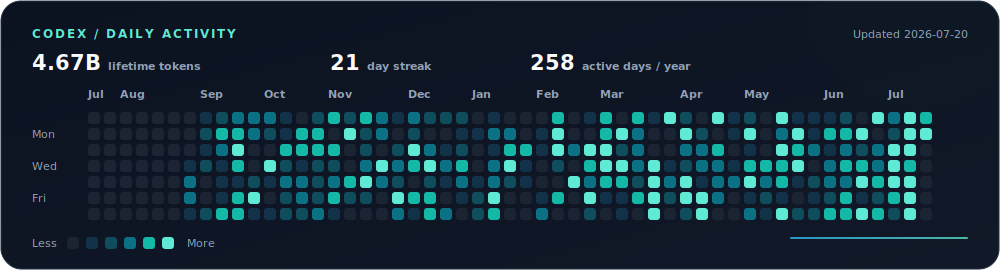
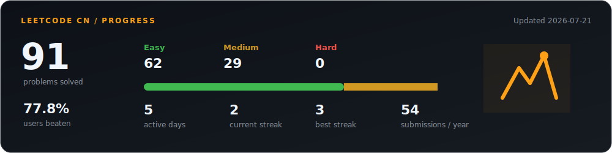
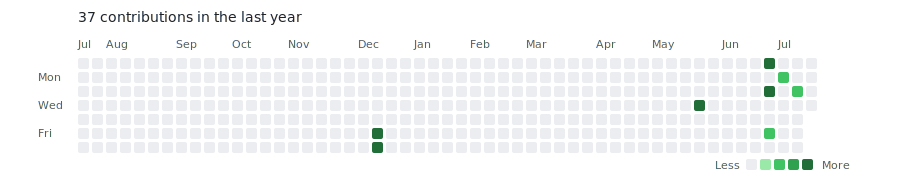

# Hi, I'm Pay4att 👋

I build AI products that connect **models, software, and hardware**.

Based in China, I work across local agents, multimodal services, real-time data pipelines, desktop products, and device automation. I care about the part after the demo: reliable deployment, recoverable state, clean APIs, and interfaces people can actually use.

### What I'm building

- **[Paper Multi-Agents Platform](https://github.com/Pay4att/Paper-MultiAgentsPlatform)** — a research workspace for paper retrieval, PDF analysis, full-text Q&A, and report generation with local models.
- **[Switch Agent](https://github.com/Pay4att/Switch-agent)** — natural-language Nintendo Switch control through a remote controller API, with scripted actions, NFC loading, and reconnect handling.
- **[Aster Music](https://github.com/Pay4att/Aster-Music)** — a full-stack music product exploring discovery, playlists, themes, authentication, and a focused playback experience.

### I work with

`Python` · `TypeScript` · `Swift` · `React` · `FastAPI` · `LangGraph` · `Ollama` · `Docker`

Most often around **AI agents**, **industrial vision**, **radar data**, and **hardware integration**.

### Codex activity

  

Daily aggregate counts from the local Codex app-server usage API.

### LeetCode activity

  

Automatically refreshed from my public LeetCode China profile.

### GitHub activity

  

Automatically refreshed from GitHub's public contribution calendar.

