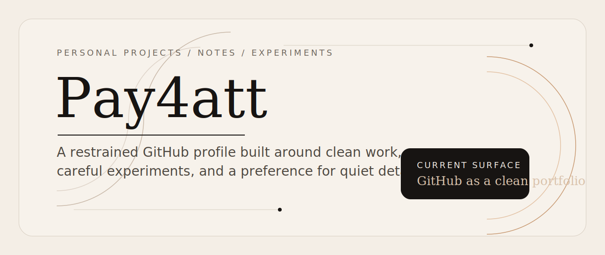

<!-- GitHub profile README for Pay4att -->

<picture>
  <source media="(prefers-color-scheme: dark)" srcset="./assets/hero-dark.svg">
  
</picture>

  Minimal by choice. Public work, quiet experiments, and a clean surface for what matters.

  <a href="#selected-work">Selected Work</a>
  ·
  <a href="#working-style">Working Style</a>
  ·
  <a href="https://github.com/Pay4att?tab=repositories">All Repositories</a>

## About

I use this profile as a compact public front door: a place to collect personal projects, small technical experiments, and work that benefits from clean presentation.

The goal is simple: keep the signal high, keep the layout calm, and let the repositories do the talking.

> I prefer structure over noise, and clarity over decoration.

## Selected Work

<table>
  <tr>
    <td valign="top" width="33%">
      <a href="https://github.com/Pay4att/HandWritingLatex"><strong>HandWritingLatex</strong></a>  
      A multi-part repository spanning handwritten math, LaTeX-oriented tooling, and supporting OCR or plugin experiments.
    </td>
    <td valign="top" width="33%">
      <a href="https://github.com/Pay4att/obsidian-releases"><strong>obsidian-releases</strong></a>  
      A fork connected to the Obsidian ecosystem, useful as a reference point for release flow, plugin distribution, and note-tooling context.
    </td>
    <td valign="top" width="33%">
      <a href="https://github.com/Pay4att?tab=repositories"><strong>Repository Index</strong></a>  
      The rest of the public surface stays intentionally lean. Browse the full list for current experiments and future additions.
    </td>
  </tr>
</table>

## Working Style

`minimal interfaces` `clear structure` `iterative building`

I like projects that become easier to understand the longer you look at them. That usually means fewer moving parts on the surface, tighter naming, and a stronger bias toward calm, readable presentation.

## Profile Notes

- This repository is the special `Pay4att/Pay4att` profile repository, so this `README.md` is what appears at the top of the GitHub profile.
- The banner adapts to both light and dark GitHub themes with local SVG assets, which keeps the page distinctive without depending on external generators.
- As more repositories become public, the `Selected Work` section can be expanded without changing the overall visual language.
