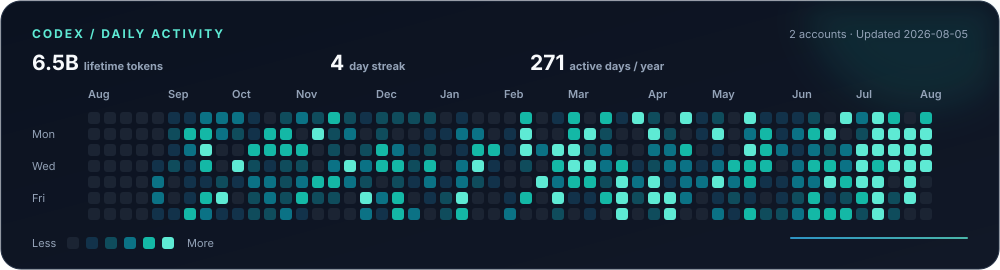
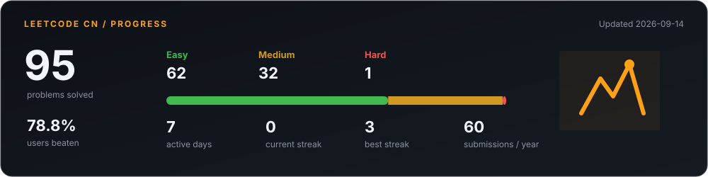
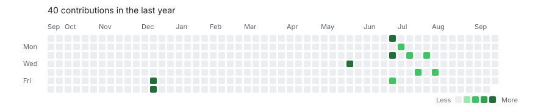

# Hi, I'm Pay4att 👋

I build AI systems that connect **models, software, and hardware**.

Based in China, I work on local agents, multimodal services, full-stack products, and device automation. I care about what happens after the demo: reliable deployment, recoverable state, clear interfaces, and tools people can actually use.

### Selected work

- **[WeiXin Codex](https://github.com/Pay4att/WeiXin-Codex)** — a secure local bridge that brings Codex to WeChat, with persistent threads, multimodal messages, image generation, and sandboxed execution.
- **[Gomoku AlphaZero](https://github.com/Pay4att/GOMOKU)** — an end-to-end AlphaZero implementation with residual policy-value networks, PUCT search, self-play, arena promotion, and resumable training.
- **[Paper Multi-Agents Platform](https://github.com/Pay4att/Paper-MultiAgentsPlatform)** — a local-model research workspace for paper retrieval, PDF analysis, full-text Q&A, and report generation.
- **[Switch Agent](https://github.com/Pay4att/Switch-agent)** — natural-language Nintendo Switch control through a remote controller API, with scripted actions, NFC loading, and reconnect handling.
- **[Aster Music](https://github.com/Pay4att/Aster-Music)** — a full-stack React music experience with discovery, playlists, authentication, themes, and focused playback.

### Toolbox

`Python` · `TypeScript` · `JavaScript` · `React` · `PyTorch` · `FastAPI` · `LangGraph` · `Ollama` · `Docker`

Most often around **AI agents**, **multimodal systems**, **industrial vision**, and **hardware integration**.

### Codex activity

  

Daily aggregate counts from the local Codex app-server usage API.

### LeetCode activity

  

Automatically refreshed from my public LeetCode China profile.

### GitHub activity

  

Automatically refreshed from GitHub's public contribution calendar.

